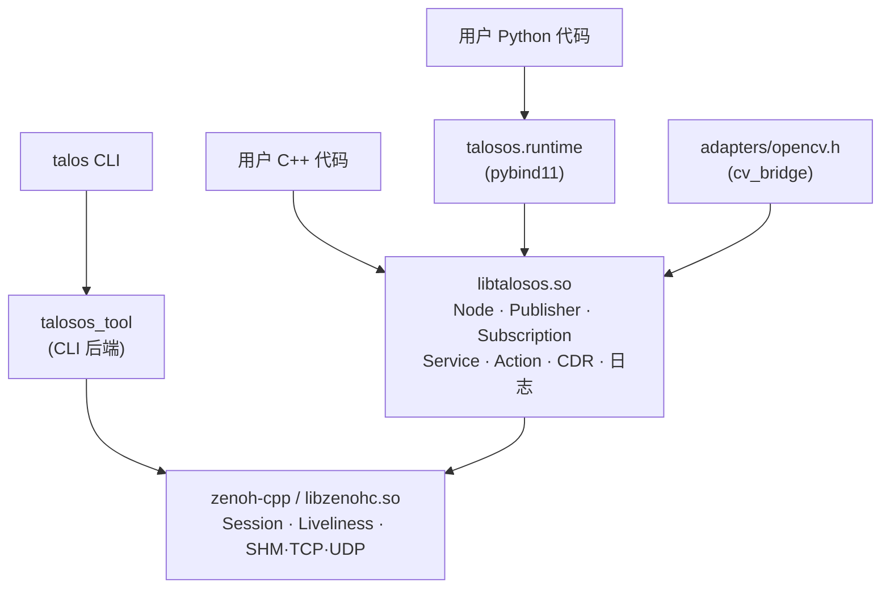

# TalosOS

**给机器人团队的轻量 ROS 替代方案。**
保留 ROS1 的手感 —— `pkg create / build / run / topic / service / launch` 原样可用；
换掉 ROS1 的引擎 —— 基于 Eclipse Zenoh 的对等发现，没有 master、没有 catkin、没有 ament_cmake；
兼容 ROS2 的 wire —— 消息仍是标准 CDR，可以直接灌 `ros2 bag`、被 Foxglove 解析。

!!! info "出品方"

    由 **杭州朗极智能科技有限公司** 构建与维护，面向产品级机器人团队。
    详见 [关于](about.md)。

---

## 为什么不直接用 ROS？

| 痛点 | ROS1 (Noetic) | ROS2 (Jazzy / Kilted) | **TalosOS** |
|---|---|---|---|
| 运行时依赖 | `roscore` 单点 | RMW plugin + 复杂 DDS 配置 | **无** — 节点对等发现 |
| 安装尺寸 | ~1.5 GB (`ros-noetic-desktop`) | ~2 GB (`ros-jazzy-desktop`) | **< 80 MB** (`/opt/talosos`) |
| 构建系统 | catkin + rosdep | ament_cmake + colcon + rosdep | **普通 CMake** + `talos build` 薄包装 |
| 包创建 | `catkin_create_pkg` + 编辑 package.xml | `ros2 pkg create` 20+ 个选项 | `talos pkg create --with-node` — 一行 |
| 跨语言 | roscpp / rospy 两套，类型非对称 | rclcpp / rclpy 独立生成代码 | **同一个 libtalosos.so**，Python 走 pybind11 |
| 跨设备 LAN | Master 绑死一台 | 默认多播 + RMW QoS 调校 | **零配置** — 装好就能互通 |
| wire 格式 | 自定义序列化 | CDR (DDS 兼容) | **CDR** — 直接兼容 ROS2 / Foxglove |
| 生命周期 | :material-alert: 已停止维护 | 维护中 | 持续迭代 |
| 学习曲线 | 低 | 中-高（很多 ROS1 用户吐槽）| **低** — ROS1 习惯基本可复用 |

*尺寸 / 延时数字是同机同硬件同等配置下的量级参考。*

---

## TalosOS 的 5 个硬优势

### :material-clock-fast: 1. 延时贴近金标准 rmw_zenoh

10 话题 × 10 Hz × 397 KB PNG 同机双进程实测：

| 传输层 | p50 | p99 | max |
|---|---|---|---|
| ROS1 TCPROS 跨进程 | 3–8 ms | >10 ms | 30+ ms |
| ROS2 + FastRTPS (默认) | 2–5 ms | ~10 ms | ~30 ms |
| ROS2 + CycloneDDS | 1.5–4 ms | ~8 ms | ~25 ms |
| ROS2 + rmw_zenoh | 1–3 ms | ~5 ms | ~20 ms |
| **TalosOS / zenoh-cpp** | **2.5 ms** | **7 ms** | **34 ms** |

本 bench 就在仓库里 (`examples/cpp/image_bench/`)，你可以在自己的机器直接复跑，
对照数字一目了然。详见 [基准数据](reference/benchmarks.md)。

### :material-rocket-launch: 2. 从 0 到跑起来 < 60 秒

```bash
# 1) 安装（一次）
scripts/install_opt.sh /opt/talosos
source /opt/talosos/setup.bash

# 2) 新工作空间 + 功能包（自动 init，不用 catkin/colcon）
mkdir -p ~/ws/src && cd ~/ws/src
talos pkg create hello --with-node

# 3) 构建 + 运行
cd ~/ws && talos build && talos run hello hello_node
```

对比 ROS2 同样的事：`mkdir ws && cd ws && mkdir src && cd src && ros2 pkg
create --build-type ament_cmake --dependencies rclcpp std_msgs hello && cd ..
&& colcon build && source install/setup.bash && ros2 run hello hello`
—— 命令多 4×，心智负担多 2×。

### :material-language-cpp: 3. 代码对比：同一件事，三套栈

=== "TalosOS"

    ```cpp
    #include "talosos/logging.h"
    #include "talosos/messages.h"
    #include "talosos/node.h"

    int main(int argc, char** argv) {
      talos::Init(argc, argv);
      auto node = talos::Node::Create("hello");
      auto pub  = node->Advertise<talos::msgs::String>("chatter");

      talos::msgs::String m; m.data = "hello";
      pub.Publish(m);
      TALOS_LOG(INFO) << "published";

      node->Spin();
    }
    ```

=== "ROS2 rclcpp"

    ```cpp
    #include "rclcpp/rclcpp.hpp"
    #include "std_msgs/msg/string.hpp"

    int main(int argc, char** argv) {
      rclcpp::init(argc, argv);
      auto node = rclcpp::Node::make_shared("hello");
      auto pub  = node->create_publisher<std_msgs::msg::String>("chatter", 10);

      std_msgs::msg::String m; m.data = "hello";
      pub->publish(m);
      RCLCPP_INFO(node->get_logger(), "published");

      rclcpp::spin(node);
      rclcpp::shutdown();
    }
    ```

=== "ROS1 roscpp"

    ```cpp
    #include "ros/ros.h"
    #include "std_msgs/String.h"

    int main(int argc, char** argv) {
      ros::init(argc, argv, "hello");
      ros::NodeHandle nh;
      auto pub = nh.advertise<std_msgs::String>("chatter", 10);

      std_msgs::String m; m.data = "hello";
      pub.publish(m);
      ROS_INFO("published");

      ros::spin();
    }
    ```

三套代码长度接近，**TalosOS 的语义与 ROS1/ROS2 完全一致**，迁移成本
就是改几个头文件。

### :material-shield-check: 4. wire 兼容：你的 CDR payload 是一等公民

TalosOS 消息用的就是 ROS2 的 CDR 小端编码 + 4 字节封装头。意味着：

- 抓到的包可以直接喂 `ros2 bag record` / `rosbag2`
- Foxglove Studio 连 zenoh 后**不需要**任何 TalosOS 专用插件
- AddTwoInts 示例里，`.msg` 代码生成版本和反射宏内联版本，**序列化字节
  完全一致**（20 B）—— 仓库里有测试覆盖

### :material-toolbox: 5. 调试、launch、rqt 都齐了

一个 CLI `talos`，九个子命令，覆盖日常所有调试需求：

```bash
talos topic list / echo / hz / bw / pub / info
talos service list / call / info
talos launch my_pkg demo.launch.yaml
talos plot  /imu/data    --type Imu         --field linear_acceleration.z
talos viz   /camera/img  --type CompressedImage
talos rqt                                # PyQt5 壳，内嵌 plot + viz 面板
```

Bash / Zsh **全 Tab 补全**，`source setup.bash` 时自动装好。详见
[CLI 参考](reference/cli.md)。

---

## 关键数字

| 指标 | 数值 | 来源 |
|---|---|---|
| 单话题延时 p50 | **2.5 ms** | `image_bench`, 397 KB PNG, 同机双进程 |
| 单话题延时 p99 | **~7 ms** | 同上 |
| 10 话题聚合吞吐 | **13 MB/s** | 10 × 10 Hz 同机 |
| 安装体积 | **< 80 MB** | `/opt/talosos` 全量含 libzenohc |
| 支持消息类型 | **~60** | 覆盖 std / geometry / sensor / nav / tf / viz / pcl / octomap 八族 |
| CLI 子命令 | **9** | `pkg / build / run / topic / service / launch / plot / viz / rqt` |
| 首个可运行节点耗时 | **< 60 s** | 见上文 60 秒速览 |

---

## 架构



---

## 什么时候选 TalosOS，什么时候不选

### :material-thumb-up: 适合

- **产品级机器人**需要最小依赖、可重复部署、延时可控
- 需要**跨设备局域网**通信但没精力折腾 DDS QoS
- 团队里有 C++ 和 Python **两种角色**，希望共享同一套消息定义
- 从 **ROS1 迁移**，不想被 ROS2 的 ament/colcon 重新教育
- 在 **嵌入式 / 边缘** 部署，对 `/opt/ros` 的体积望而却步

### :material-thumb-down: 暂时不适合

- 需要用 ROS2 **现成的大型开源栈**（Nav2、MoveIt2、gazebo_ros_pkgs 等）
  —— 这些直接用 ROS2，再用 `rmw_zenoh` 把底层切过来即可
- 需要 **Windows / macOS** 生产环境（当前只在 Linux 测试）
- 项目已深度集成 **ROS1 nodelet / dynamic_reconfigure** 机制 ——
  TalosOS 的 action / service 是对等物，但不是行为完全一致

---

## 核心特性

- :material-transit-connection-variant: **ROS 的手感，现代的传输层** — zenoh-cpp 自带 LAN 对等发现、广域路由、共享内存快路径
- :material-package-variant-closed: **一次安装，双语言可用** — `cmake --install` 就位 C++ 库 + CLI + Python 绑定 + 示例 + 补全
- :material-shield-check: **wire 与 ROS2 兼容** — 消息使用标准 CDR 小端编码，可被 `ros2 bag` / Foxglove 解析
- :material-lan-connect: **零配置跨设备** — 同一局域网节点自动发现，跨段可显式 `--connect / --listen` 直连
- :material-image-multiple: **开箱 cv_bridge** — `cv::Mat` ↔ `sensor_msgs::Image` 零拷贝视图，支持 JPEG/PNG codec
- :material-file-code: **两种自定义消息路径** — 反射宏一行写完；`.msg` 代码生成走 ROS 老路

---

## 功能导航

| 领域 | 起步文档 |
|---|---|
| :material-package-variant: 功能包 / 构建 / 运行 | [功能包与构建](tutorials/packages.md) |
| :material-wifi-arrow-left-right: 发布 / 订阅 | [示例一 · 话题编程](tutorials/topic.md) |
| :material-swap-horizontal: 服务 (Service) | [示例二 · 服务编程](tutorials/service.md) |
| :material-timer-sand: 动作 (Action) | [示例三 · 动作编程](tutorials/action.md) |
| :material-file-code: 自定义消息 | [示例四 · 自定义消息](tutorials/custom-messages.md) |
| :material-image-multiple: 图像传输 / cv_bridge | [示例五 · 图像传输](tutorials/image-transport.md) |
| :material-dots-grid: 点云传输 | [示例六 · 点云传输](tutorials/pointcloud-io.md) |
| :material-axis-arrow: IMU / TF / Marker / Grid / Octomap | [示例七 · 其他数据类型](tutorials/more-data.md) |
| :material-launch: Launch 启动文件 | [Launch](tutorials/launch.md) |
| :material-eye-circle: rqt / viz 可视化 | [rqt / viz 工具箱](tutorials/rqt.md) |
| :material-server-network: 局域网 / 跨设备部署 | [LAN 部署](deployment/lan.md) |
| :material-speedometer: 性能基准 | [benchmarks](reference/benchmarks.md) |

---

## 继续阅读

- :material-clock-fast: 完全新手 → [安装](installation.md) → [功能包与构建](tutorials/packages.md) → [示例一 · 话题编程](tutorials/topic.md)
- :material-card-text: 一页速查 → [Cheatsheet](cheatsheet.md)
- :material-help-circle: 排障 → [FAQ](faq.md)
- :material-swap-horizontal-variant: ROS1 / ROS2 迁移 → [CLI 对照](reference/cli.md) · [架构](reference/architecture.md)
- :material-speedometer: 性能调优 → [基准数据](reference/benchmarks.md)
- :material-robot-happy: **AI 编程助手** → 仓库根的 `AGENTS.md`
