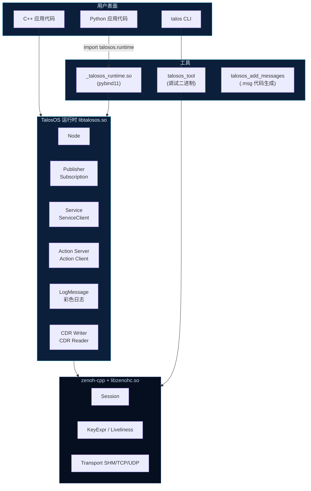
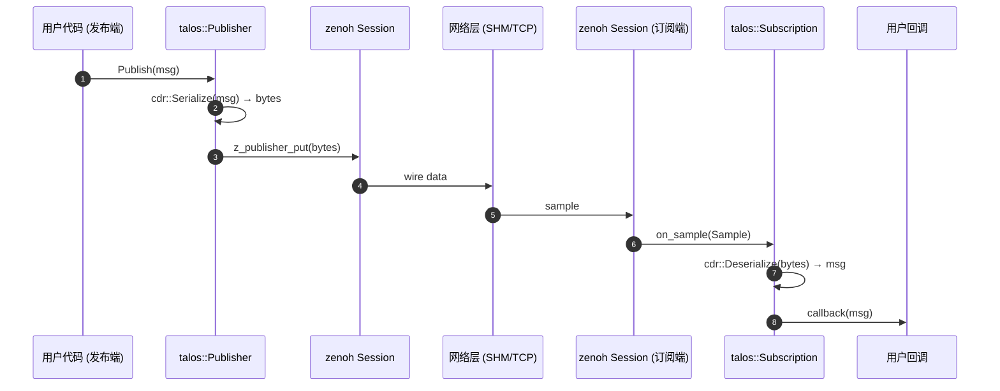
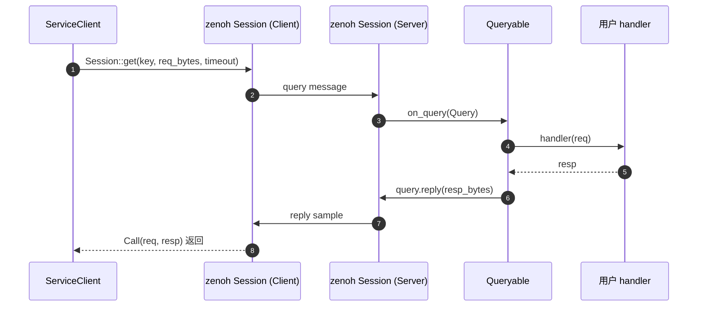
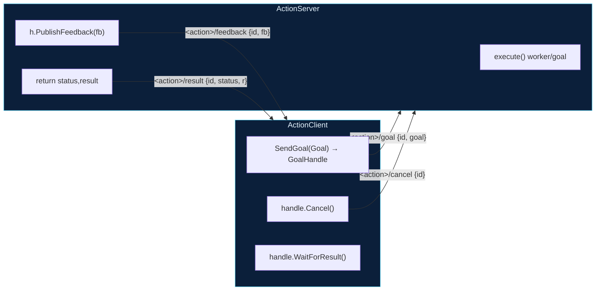

# 架构

一个简明的组件导览，有助于扩展 TalosOS 或排查传输层问题。

## 分层俯瞰



## 发布 → 订阅 的生命周期



## 服务 Query/Reply 时序



## 动作的 4 话题 + UUID



## 名字解析

TalosOS 沿用 ROS 的命名规则，但映射到 zenoh key 时会去掉前导 `/`。

```mermaid
flowchart LR
  I1["Advertise('image')"]        -->|"&lt;ns/name&gt;/image"| K1["zenoh key: robot1/cam/image"]
  I2["Advertise('/image')"]       -->|"已是绝对"|              K2["zenoh key: image"]
  I3["Advertise('~/image')"]      -->|"私有别名"|              K3["zenoh key: robot1/cam/image"]

  style I1 fill:#0b1f3a,stroke:#6ee2ff,color:#e5f4ff
  style I2 fill:#0b1f3a,stroke:#6ee2ff,color:#e5f4ff
  style I3 fill:#0b1f3a,stroke:#6ee2ff,color:#e5f4ff
```

例子：`Node("cam", {.ns = "/robot1"})` 下 `Advertise("image")` 映射到 zenoh
key `robot1/cam/image`；CLI 显示时自动补回前导 `/`。

## 发现机制

每个 `Publisher` / `Service` 构造时会在 zenoh 里同时注册一个 liveliness
token：

| 类型 | liveliness key |
| --- | --- |
| Publisher | `_talos/pub/<topic_key>/_n/<node_fqn>` |
| Service | `_talos/srv/<service_key>/_n/<node_fqn>` |

`talos topic list` / `talos service list` 通过查询 `_talos/pub/**` 或
`_talos/srv/**` 枚举这些 token，再解出 `<topic_key>` 和 `<node_fqn>`。
Token 随对象析构自动注销 —— 节点重启立即消失，不像 ROS1 master 可能
留脏表。

## 链接关系


`libtalosos.so` 嵌入 `RUNPATH=$ORIGIN`，所以不管是 `talos run` 还是直接
跑用户二进制，都能找到**同目录**的 `libzenohc.so`，**不需要**
`LD_LIBRARY_PATH`（见 [FAQ](../faq.md#libzenohc)）。

## 关键文件位置

```
TalosOS/
├── include/talosos/
│   ├── node.h            ← Node / Publisher / Subscription
│   ├── service.h         ← Service / ServiceClient
│   ├── action.h          ← Action server/client (header-only)
│   ├── messages.h        ← std/geometry/sensor/nav/tf/viz/pcl/octomap 聚合
│   ├── msgs/             ← 分族子头
│   ├── serialization.h   ← CDR Writer/Reader + TALOS_MESSAGE_FIELDS
│   ├── logging.h         ← 彩色日志 / TALOS_LOG(LEVEL)
│   └── adapters/         ← opencv.h (cv_bridge) / eigen.h / pcl.h
├── src/
│   ├── node.cc           ← 与 zenoh-cpp 对接的运行时
│   ├── logging.cc
│   ├── tool/talosos_tool.cc        ← CLI 后端二进制
│   └── python/bindings.cc          ← pybind11 绑定
├── python/talosos/
│   ├── cli.py            ← talos CLI 入口
│   ├── runtime.py        ← 高级 Python API (壳在 bindings.cc 上)
│   ├── messages.py       ← Python CDR dataclass 镜像
│   └── commands/         ← 各子命令实现
├── cmake/                ← TalosOSConfig / TalosMessages / setup scripts
├── examples/             ← cpp/ + python/
├── docs/wiki/            ← 本文档
└── scripts/install_opt.sh
```
