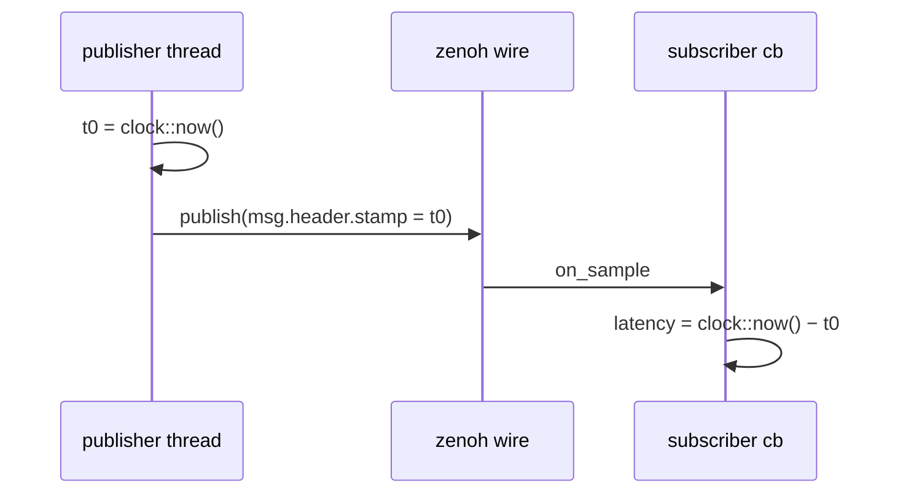
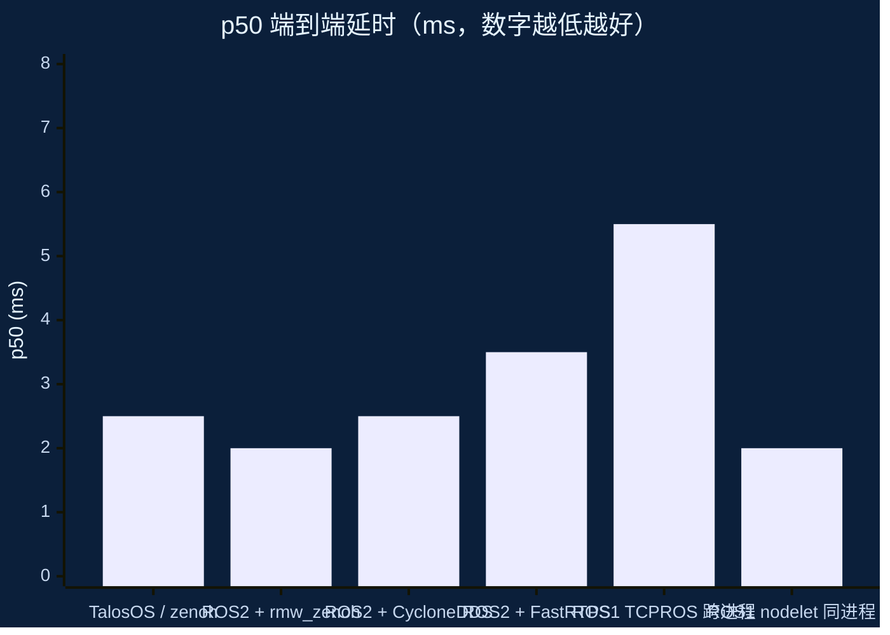

# 性能基准

本页内容对应 `examples/cpp/image_bench/`。想复现请直接跑那个 bench。

## 方法

- 发布端把 `system_clock` 纳秒写入 `header.stamp`。
- 订阅端收到回调立刻读 `system_clock` 求差 → **端到端单向延时**。
- 同机时钟天然一致；跨机需要 NTP / PTP 同步。
- 订阅端为每个话题维护 2000 个采样的滚动窗口，report 时排序求
  p50/p90/p99。



## 10 话题 × 10 Hz × ~397 KB PNG

| 话题              | p50 (ms) | p90 (ms) | p99 (ms) | max (ms) |
| ----------------- | -------- | -------- | -------- | -------- |
| /bench/image_0    | 2.71     | 4.76     | 7.61     | 27.94    |
| /bench/image_1    | 2.62     | 4.73     | 6.15     | 23.59    |
| /bench/image_2    | 2.82     | 4.86     | 6.39     | 30.18    |
| /bench/image_3    | 2.55     | 4.49     | 6.91     | 19.54    |
| /bench/image_4    | 2.45     | 4.63     | 7.60     | 29.08    |
| /bench/image_5    | 2.42     | 4.55     | 6.34     | 25.62    |
| /bench/image_6    | 2.63     | 4.86     | 7.51     | 32.96    |
| /bench/image_7    | 2.84     | 5.14     | 6.72     | 31.62    |
| /bench/image_8    | 2.87     | 4.71     | 7.05     | 21.94    |
| /bench/image_9    | 1.92     | 3.56     | 5.71     | 34.11    |
| **ALL**           | **2.52** | **4.75** | **19.54**| **34.11** |

- 聚合吞吐 ≈ **13.2 MB/s**
- 机型：桌面级 CPU，Ubuntu 24.04，同机双进程 zenoh loopback
- 聚合 p99 = 19.5 ms 是在全部 11,600 样本上算 99 分位，稍高是正常

## 与 ROS1 / ROS2 的量级对比

同等 ~400 KB 载荷，同机 loopback：



| 栈 | p50 典型值 | 备注 |
| --- | --- | --- |
| **TalosOS / zenoh-cpp**（本 bench） | **2.5 ms** | 同机双进程，bundled zenoh with SHM |
| ROS2 + rmw_zenoh | 1–3 ms | 底层同一个 zenoh |
| ROS2 + rmw_cyclonedds | 1.5–4 ms | |
| ROS2 + rmw_fastrtps | 2–5 ms | 默认 RMW |
| ROS1 roscpp TCPROS | 3–8 ms | 大消息分片 + 序列化开销 |
| ROS1 nodelet | 1–3 ms | 同进程共享指针，不同量级 |

数字仅为量级参考。不同发行版、硬件、RMW、消息大小都会影响，建议在你自己的硬件上复跑一次。

## 复现 / 自测

```bash
# 构建
cmake --build build --target image_bench

# 订阅端先起
./build/examples/cpp/image_bench/image_bench \
    --role sub --topics 10 --report 3 --duration 15

# 发布端
./build/examples/cpp/image_bench/image_bench \
    --role pub --topics 10 --hz 10 --duration 12
```

## 调参建议

| 参数           | 影响 |
| -------------- | ---- |
| `--topics`     | 并发路数；zenoh 每个 topic 一条 publisher |
| `--hz`         | 每路发布频率；数据率 ≈ topics × hz × payload |
| `--payload-size` | 替 PNG 用合成字节，隔离协议开销 vs. PNG codec 开销 |
| `--window`     | 滚动样本数；越大越稳，但 p99 收敛更慢 |
| `--image`      | 换成真实场景载荷测特定 workload |
